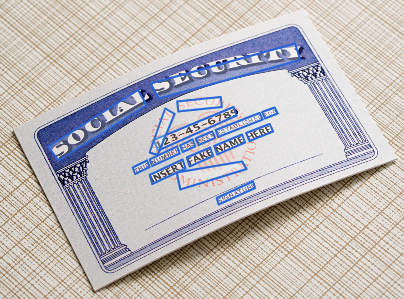
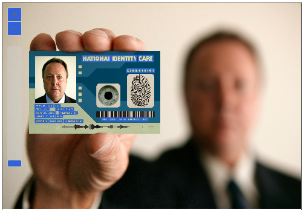
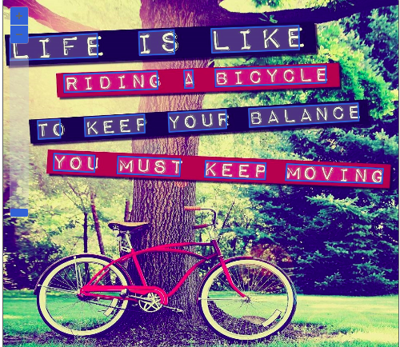

# laboratorioai2

## A primeira imagem utilizada foi a seguinte:

Primeiro criamos um novo recurso no portal do zaure: www.azure.com

Após toda essa etapa acessamos o seguinte portal e seguimos os passos decritos nesse link [Clique aqui para acessar o laboratório de OCR](https://microsoftlearning.github.io/mslearn-ai-fundamentals/Instructions/Labs/05-ocr.html)

A inteligência do azure é excepicional, facilmente você consegue navegar pelo portal e os resultados são interessantes, sem dificuldade alguma você consegue obter os resultados propostos, cada caracter da imagem foi capturada e ela em momento algum deu erro por capturar qualquer outra coisa que não fora os caracteres da imagem. 

## Segunda Imagem utilizada:

Esse exemplo é interessantíssimo, mesmo havendo vários tipos de imagens no cartão e ainda havendo uma imagem desfocada ao fundo, a AI capitura todos os caracteres disponivéis,entregando um resultado eficiente e eficaz, um simples exemplo, mas que já demostra o quão preciso essa ferramenta é.

## Terceira e última Imagem utilizada:

Essa imagem está com muitas informações que poderia confundir a AI, mas isso não aconteceu, ela capturou todos os caracteres precisamente.

## Resultados

Em todos os exemplos a resposta da IA da Microsoft demonstrou resultados precisos, além de haver uma gama de recursos a ser explorados.

